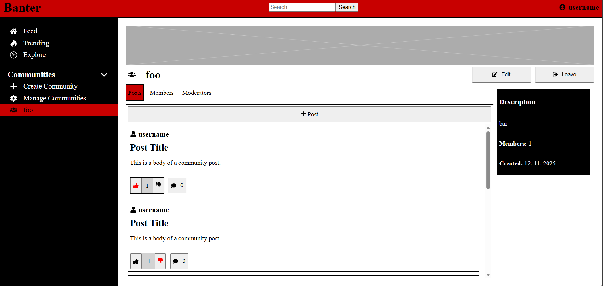

# Banter

This is a side project created for learning purposes. This website is inspired by social media website Reddit and aims to replicate its core features. The development of this project is still ongoing.

## Used Technologies

- Javascript
- Node.js
- Express.js
- React.js
- Sequelize.js
- MySQL

## Finished Functionalities:

- Authenthication
- Navigation

## Planned Functionalities:

- password reset via email
- community tags
- posts, comments and reactions in communities
- media storage for user icons, community banners, community icons, post media and comment media
- feed page: page for displaying posts from subscribed communities
- trending page: page for displaying recent posts
- explore page: page for finding communities
- subscriptions page: page for managing subscribed communities
- search page: search communities, posts, comments, users
- user interaction via instant messaging
- deploy to Microsoft Azure
