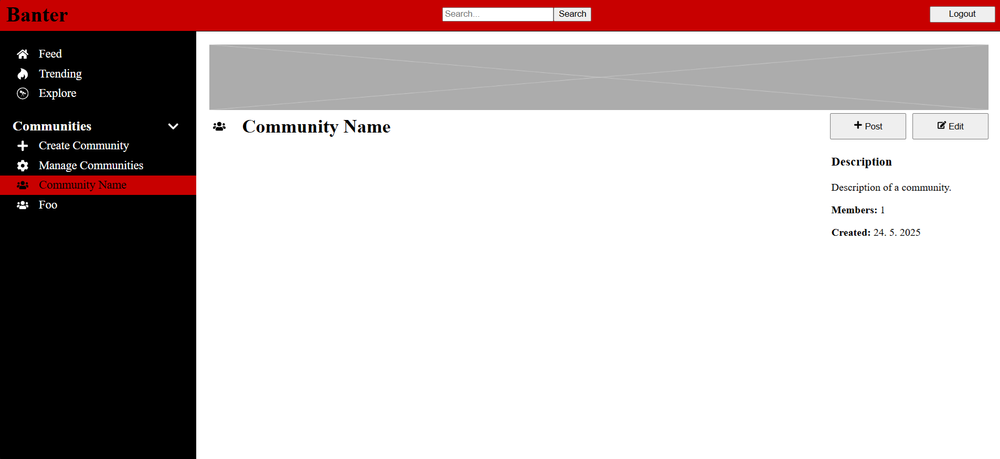

# Banter

This is a side project created for learning purposes. This website is inspired by social media website Reddit and aims to replicate its core features. The development of this project is still ongoing.

## Used Technologies

- Javascript
- CSS
- Node.js
- Express.js
- Sequelize.js
- React.js
- MySQL

## Finished Functionalities:

- Authenthication: registration, login and logout
- Feed page: page for displaying posts from subscribed communities
- Trending page: page for displaying recent posts
- Subscriptions Page: page for managing subscribed communities
- Community Page: page for displaying community content
- User Page: page for displaying user content
- Post Page: page for post discussion
- Search Page: page for searching all content
- Reset Password Page: page for setting new password if user forgot the previous one

## Planned Functionalities:

- deploy to AWS
- media storage for user icons, community banners, community icons, post media and comment media
